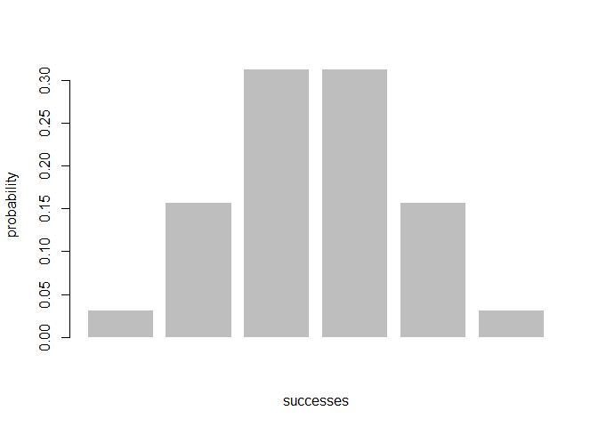
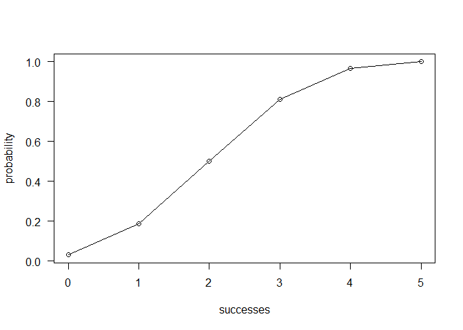

README
================

Overview
--------

The package `"binomal"` is a minimal implementation for calculating probabilities of a Binomial random variable, and related calculations such as the probability distribution, the expected value, variance.

-   `bin\_choose()`: calculates the number of combinations in which k successes can occur in n trials
-   `bin_probability()`: calculates the probability of getting k successes in n trials with specific probability of success.
-   `bin_distribution()`:  returns a data frame with the probability distribution
-   `bin_cumnulative()`: returns a data frame with both the probability distribution and the cumulative probabilities
-   `bin_variable()`: returns an object of class "binvar", a binomial random variable object.
-   `bin_variable()`: calculates a binomial random variable object
-   `bin_mean()`: calculates the mean of a binomail distribution
-   `bin_variance()`: calculates the varince of a binomail distribution
-   `bin_mode()`: calculates the mode of a binomail distribution
-   `bin_skewness()`: calculates the skewness of a binomail distribution
-   `bin_kurtosis()`: calculates the kurtosis of a binomail distribution

Installation
----------------------

Install the development version from GitHub via the package
`"devtools"`:

``` r
# development version from GitHub:
#install.packages("devtools") 

# install "binomial" (without vignettes)
devtools::install_github("stat133-sp19/hw-stat133-XueqingZheng/binomial")

# install "cointoss" (with vignettes)
devtools::install_github("stat133-sp19/hw-stat133-XueqingZheng/binomial", build_vignettes = TRUE)
```


Usage
----------------------

``` r
bin_choose(n = 5, k = 2)
#> [1] 10
bin_choose(5, 0)
#> [1] 1
bin_choose(5, 1:3)
#> [1]  5 10 10
```

``` r
# probability of getting 2 successes in 5 trials
# (assuming prob of success = 0.5)
bin_probability(success = 2, trials = 5, prob = 0.5)
#> [1] 0.3125

# probabilities of getting 2 or less successes in 5 trials
# (assuming prob of success = 0.5)
bin_probability(success = 0:2, trials = 5, prob = 0.5)
#> [1] 0.03125 0.15625 0.31250

# 55 heads in 100 tosses of a loaded coin with 45% chance of heads
bin_probability(success = 55, trials = 100, prob = 0.45)
#> [1] 0.01075277
```

``` r
# binomial probability distribution
bin_distribution(trials = 5, prob = 0.5)
#>   success probability
#> 1       0     0.03125
#> 2       1     0.15625
#> 3       2     0.31250
#> 4       3     0.31250
#> 5       4     0.15625
#> 6       5     0.03125
```


``` r
# plotting binomial probability distribution
dis1 <- bin_distribution(trials = 5, prob = 0.5)
plot(dis1)
```




``` r
# binomial cumulative distribution
bin_cumulative(trials = 5, prob = 0.5)
#>   success probability cumulative
#> 1       0     0.03125    0.03125
#> 2       1     0.15625    0.18750
#> 3       2     0.31250    0.50000
#> 4       3     0.31250    0.81250
#> 5       4     0.15625    0.96875
#> 6       5     0.03125    1.00000
```


``` r
# plotting binomial cumulative distribution
dis2 <- bin_cumulative(trials = 5, prob = 0.5)
plot(dis2)
```




``` r
bin1 <- bin_variable(trials = 10, p = 0.3)
bin1
#> "Binomial variable"
#> 
#> Paramaters
#> - number of trials:  10 
#> - prob of success:  0.3
```


``` r
binsum1 <- summary(bin1)
binsum1
#> "Summary Binomial"
#> 
#> Paramaters
#> - number of trials:  10 
#> - prob of success:  0.3 
#> 
#> Measures
#> - mean    :  3 
#> - variance:  2.1 
#> - mode    :  0.2760262 
#> - kurtosis:  -0.1238095
```

``` r
bin_mean(10, 0.3)
#> [1] 3
bin_variance(10, 0.3)
#> [1] 2.1
bin_mode(10, 0.3)
#> [1] 3
bin_skewness(10, 0.3)
#> [1] 0.2760262
bin_kurtosis(10, 0.3)
#> [1] -0.1238095
```
