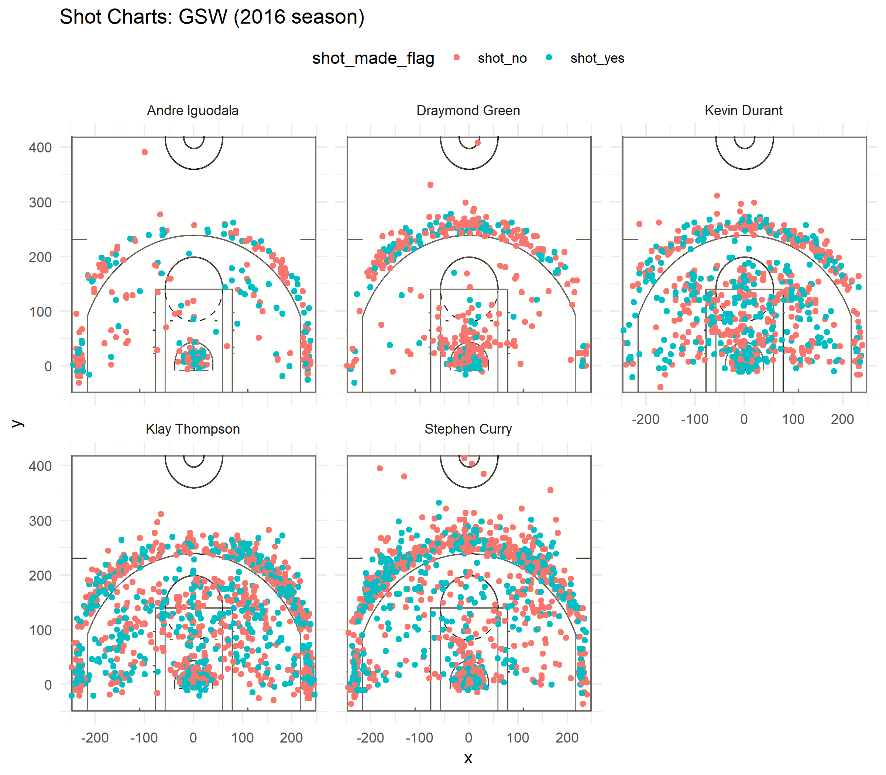

workout01-xueqing-zheng.Rmd
================
Xueqing Zheng



5.1) Effective Shooting Percentage
----------------------------------

``` r
library(dplyr)
```

    ## 
    ## Attaching package: 'dplyr'

    ## The following objects are masked from 'package:stats':
    ## 
    ##     filter, lag

    ## The following objects are masked from 'package:base':
    ## 
    ##     intersect, setdiff, setequal, union

``` r
shots_data <- read.csv("../data/shots-data.csv")
```

``` r
#2PT Effective Shooting % by Player:
twopt <- shots_data %>%
  filter(shot_type == "2PT Field Goal") %>%
  #select(name, shot_made_flag) %>%
  group_by(name) %>%
  summarise(
    total = sum(shot_type == "2PT Field Goal"),
    made = sum(shot_made_flag == "shot_yes"),
    perc_made = made / total
    ) %>%
  arrange(desc(perc_made))

#3PT Effective Shooting % by Player
threept <- shots_data %>%
  filter(shot_type == "3PT Field Goal") %>%
  #select(name, shot_made_flag) %>%
  group_by(name) %>%
  summarise(
    total = sum(shot_type == "3PT Field Goal"),
    made = sum(shot_made_flag == "shot_yes"),
    perc_made = made / total
    ) %>%
  arrange(desc(perc_made))

#Effective Shooting % by Player:
eff_pt <- shots_data %>%
  filter(shot_type == "3PT Field Goal" | shot_type == "2PT Field Goal") %>%
  #select(name, shot_made_flag) %>%
  group_by(name) %>%
  summarise(
    total = sum(shot_type == "3PT Field Goal" | shot_type == "2PT Field Goal"),
    made = sum(shot_made_flag == "shot_yes"),
    perc_made = made / total
    ) %>%
  arrange(desc(perc_made))

 knitr::kable(twopt)
```

| name           |  total|  made|  perc\_made|
|:---------------|------:|-----:|-----------:|
| Andre Iguodala |    210|   134|   0.6380952|
| Kevin Durant   |    643|   390|   0.6065319|
| Stephen Curry  |    563|   304|   0.5399645|
| Klay Thompson  |    640|   329|   0.5140625|
| Graymond Green |    346|   171|   0.4942197|

``` r
 knitr::kable(threept)
```

| name           |  total|  made|  perc\_made|
|:---------------|------:|-----:|-----------:|
| Klay Thompson  |    580|   246|   0.4241379|
| Stephen Curry  |    687|   280|   0.4075691|
| Kevin Durant   |    272|   105|   0.3860294|
| Andre Iguodala |    161|    58|   0.3602484|
| Graymond Green |    232|    74|   0.3189655|

``` r
 knitr::kable(eff_pt)
```

| name           |  total|  made|  perc\_made|
|:---------------|------:|-----:|-----------:|
| Kevin Durant   |    915|   495|   0.5409836|
| Andre Iguodala |    371|   192|   0.5175202|
| Klay Thompson  |   1220|   575|   0.4713115|
| Stephen Curry  |   1250|   584|   0.4672000|
| Graymond Green |    578|   245|   0.4238754|
